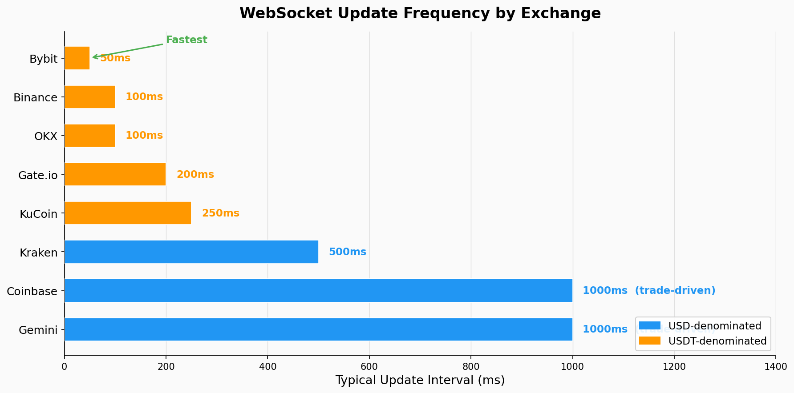
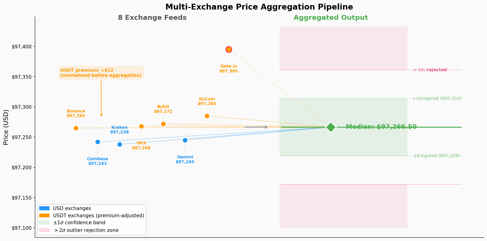

# pulsefeed

Real-time, multi-exchange crypto market data aggregation with tick-level capture and cross-exchange divergence detection. Connects to **8 exchanges simultaneously** via WebSocket, producing a unified price feed with confidence scoring for **BTC, ETH, SOL, and XRP**.

## Why Multi-Exchange Aggregation

No single exchange has the "true" price. Binance BTC/USDT, Coinbase BTC/USD, and Kraken BTC/USD regularly diverge by 0.1-0.3% — and during volatility events, by 1%+. For prediction market strategies where the edge is 2-5 cents on a $1 contract, using a single exchange's price as ground truth can create phantom signals or miss real ones.

PulseFeed solves this by aggregating across 8 exchanges with outlier detection, USDT premium normalization, and confidence scoring — producing a single reference price that's more robust than any individual source. The cross-exchange divergence itself becomes a tradeable signal.

## Architecture

```
    ┌────────┐ ┌────────┐ ┌────────┐ ┌────────┐ ┌────────┐ ┌────────┐ ┌────────┐ ┌────────┐
    │Binance │ │Coinbase│ │ Kraken │ │  OKX   │ │ Bybit  │ │ Gemini │ │ KuCoin │ │Gate.io │
    │BTC/USDT│ │BTC/USD │ │BTC/USD │ │BTC/USDT│ │BTC/USDT│ │BTC/USD │ │BTC/USDT│ │BTC/USDT│
    └───┬────┘ └───┬────┘ └───┬────┘ └───┬────┘ └───┬────┘ └───┬────┘ └───┬────┘ └───┬────┘
        │          │          │          │          │          │          │          │
        │  WebSocket connections (auto-reconnect with exponential backoff)          │
        │          │          │          │          │          │          │          │
    ┌───▼──────────▼──────────▼──────────▼──────────▼──────────▼──────────▼──────────▼───┐
    │                         Per-Exchange Feed Handlers                                  │
    │                     (normalize format, detect staleness)                            │
    └───────────────────────────────────┬────────────────────────────────────────────────┘
                                        │
                           ┌────────────▼────────────────┐
                           │     Price Aggregator         │
                           │                              │
                           │  1. Staleness filter         │
                           │     (drop feeds >5s stale)   │
                           │  2. USDT premium detection   │
                           │     (normalize USDT→USD)     │
                           │  3. Outlier rejection        │
                           │     (>2σ from median)        │
                           │  4. Median price             │
                           │  5. Confidence score (0-1)   │
                           │  6. Divergence tracking      │
                           └──────────┬─────────────────┘
                                      │
                    ┌─────────────────┼─────────────────┐
                    │                 │                 │
                    ▼                 ▼                 ▼
            ┌──────────────┐  ┌────────────┐  ┌────────────────┐
            │  Unified     │  │ Chainlink  │  │ Data Capture   │
            │  Price Feed  │  │ Oracle     │  │ Pipeline       │
            │              │  │ Comparison │  │                │
            │  • Price     │  │            │  │ • CSV export   │
            │  • Spread    │  │ • Lead-lag │  │ • JSONL.gz     │
            │  • Confidence│  │   signals  │  │   tick data    │
            │  • Divergence│  │ • On-chain │  │ • 500ms res    │
            │              │  │   vs CEX   │  │                │
            └──────────────┘  └────────────┘  └────────────────┘
```

## Exchange Latency

WebSocket update frequency varies by an order of magnitude across exchanges. Bybit and Binance push updates at 50-100ms intervals, while Coinbase and Gemini are trade-driven (~1s). The aggregator weights all sources equally but uses staleness detection to drop feeds that fall behind.



## Aggregation Pipeline

Eight exchange prices are normalized (USDT premium removed), filtered for staleness, and reduced to a single median price with confidence scoring. Outliers beyond 2 standard deviations are rejected before aggregation.



## Key Features

| Feature | What It Does | Why It Matters |
|---------|-------------|----------------|
| **Median aggregation** | Uses median over mean across exchanges | Robust to single-exchange outliers and flash wicks |
| **USDT premium detection** | Separates USD vs USDT pricing | 0.1-0.3% USDT premium creates phantom arb signals if ignored |
| **Confidence scoring** | 0-1 score based on exchange agreement | Low confidence = high divergence = potential signal or data issue |
| **Divergence tracking** | Real-time cross-exchange spread monitoring | Exchange divergence itself is a tradeable signal (mean-reverting) |
| **Chainlink comparison** | Lead-lag vs on-chain oracle price | On-chain oracles lag CEX by 1-3 blocks — quantifiable edge |
| **L2 orderbook recording** | Tick-level bid/ask to compressed JSONL | Enables offline microstructure analysis |
| **Auto-reconnect** | Exponential backoff per exchange | Production reliability — individual exchange failures don't kill the feed |
| **Market discovery** | Automatic Polymarket event contract enumeration | Find and subscribe to new BTC markets as they're created |

## Supported Exchanges

| Exchange | Pair | Protocol | Notes |
|----------|------|----------|-------|
| Binance | BTC/USDT | WebSocket | Highest volume, USDT-denominated |
| Coinbase | BTC/USD | WebSocket | USD-denominated, US regulatory reference |
| Kraken | BTC/USD | WebSocket v2 | Recently migrated from v1 |
| OKX | BTC/USDT | WebSocket v5 | Requires channel subscription format |
| Bybit | BTC/USDT | WebSocket v5 | Derivatives-heavy exchange |
| Gemini | BTC/USD | WebSocket | Regulated US exchange |
| KuCoin | BTC/USDT | WebSocket | Requires token-based auth for WS |
| Gate.io | BTC/USDT | WebSocket | Spot + margin |

## Quick Start

```python
from pulsefeed import PulseFeed

feed = PulseFeed(
    exchanges=["binance", "coinbase", "kraken", "okx"],
    symbol="BTC"
)
feed.start()

price = feed.get_price()          # Aggregated price
div = feed.get_divergence()       # Cross-exchange spread %
conf = feed.get_confidence()      # Agreement score (0-1)
signal = feed.get_oracle_signal() # 'LONG' | 'SHORT' | 'NEUTRAL'
```

## Data Capture

```python
from capture.capture import MultiMarketCapture

capture = MultiMarketCapture(
    assets=["btc", "eth"],
    exchanges=["binance", "coinbase", "kraken"]
)
capture.run(duration=3600)  # Capture for 1 hour
# Output: CSV files with 500ms tick resolution
```

## Documentation

| Document | Description |
|----------|-------------|
| [docs/AGGREGATION_METHODOLOGY.md](docs/AGGREGATION_METHODOLOGY.md) | Why median over mean, USDT premium detection, confidence scoring algorithm, staleness handling |
| [docs/EXCHANGE_NOTES.md](docs/EXCHANGE_NOTES.md) | Per-exchange technical notes: WebSocket quirks, latency characteristics, reconnection strategies |

## Examples

| Example | Description |
|---------|-------------|
| [examples/basic_feed.py](examples/basic_feed.py) | Minimal aggregation setup |
| [examples/divergence_monitor.py](examples/divergence_monitor.py) | Real-time cross-exchange spread detection |
| [examples/multi_asset_feed.py](examples/multi_asset_feed.py) | Simultaneous BTC + ETH + SOL capture |

## Configuration

Copy `.env.example` to `.env`:
```
CHAINLINK_API_KEY=your_key_here
CHAINLINK_API_SECRET=your_secret_here
```

Without Chainlink credentials the oracle feed falls back to Kraken REST polling (1s interval).

## Tech Stack

- Python, `websockets`, `asyncio`
- Chainlink Data Streams API
- JSONL + gzip for tick storage
- CSV for time-series export

## Related Projects

- [polymarket-sdk](https://github.com/pascal-labs/polymarket-sdk) — Polymarket CLOB integration that consumes PulseFeed data
- [event-probability-models](https://github.com/pascal-labs/event-probability-models) — BTC prediction models built on PulseFeed's multi-exchange data
- [polymarket-research](https://github.com/pascal-labs/polymarket-research) — Microstructure research using captured tick data

## License

MIT
